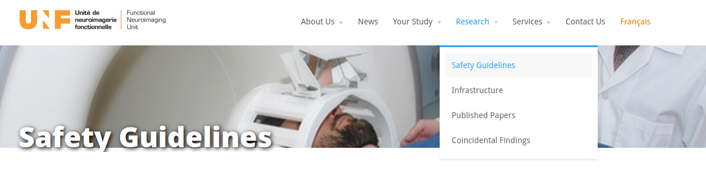

# Safety Training

A course on security measures associated with a high field MRI system is **mandatory** for all UNF's members (i.e. operators, researchers, students, post-docs and research assistants) as well as for all IUGM's employees that are likely to access the UNF. 

This course is given by the UNF operator or technologist, and covers:

-   Basic principles of magnetic fields

-   Security measures in the MRI room

-   Siemens security video

-   A visit to the UNF

-   Individual safety screening form

-   Questions

Please consult the UNF website for upcoming dates, times and location.

All students, researchers, employees, research assistants, etc. who plan to enter the UNF for their projects or work must attend the Safety Training Course offered by the UNF prior to beginning their projects/work rotation.

-   The course is offer approximately once a month. 

-   Future dates can be found on the website.

-   The course is free and lasts about 60 minutes.

[*http://www.unf-montreal.ca/site/safety-guidelines/*](http://www.unf-montreal.ca/site/safety-guidelines/)