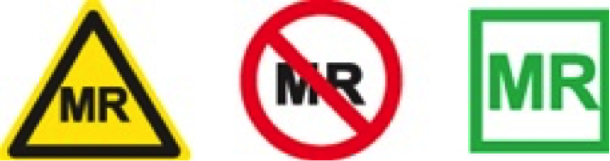

# Material from outside the UNF

Some MRI projects require specialized equipment to perform their experiments. Equipment from another laboratory may be used in the UNF area, however **any equipment entering the MRI scan room MUST be verified by an UNF employee.**

*Only MRI compatible equipment is safe to enter the MRI Room.*

**MR conditional		 MR unsafe 		MR safe** 

**Some products have labels on them indicating if they are MR-Conditional,MR-Unsafe or MR-Safe. Most products are not labelled.**