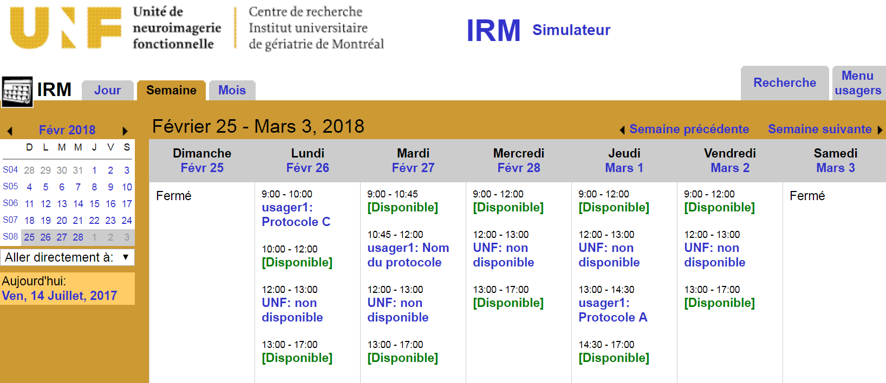
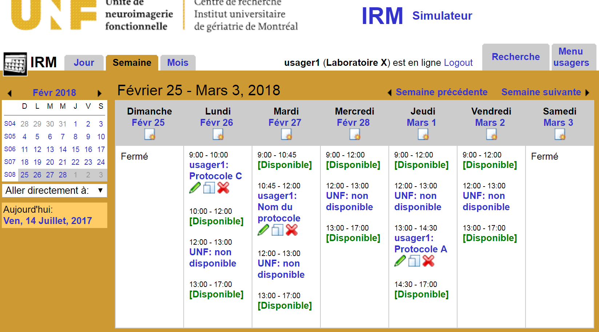

# Making a resveration
To reserve the MRI scanner or the simulation room, you must obtain a reservation account, once your account has been obtained, you can submit reservation requests via the [web calendar] (http://reservationunf.criugm.qc.ca/main.php?calendarid=IRM).

## Simulation room
The simulator room is available at all times (i.e. day, evening, weekend) if:

* You have completed the IRM security training and obtained an access card for the UNF
**and**
* You can use the equipment independently and do not need support from UNF staff

## MRI
Reservations for MRI are subject to the following rules:

- 30 minutes is the minimum time one can reserve the scanner.
- Booking times are done in 15 minute increments, (i.e. 45minutes, 1 hour, 75 minutes, etc.)
-   Set-up time for the MRI suite and control room and clean-up must be taken into consideration when reserving time blocks.
-   Reservations must be made during normal business hours (i.e. from Monday to Friday, from 9:00 am to 12:00 pm and from 1:00 pm to 5:00 pm).
-   Reservations can be arranged for scanning outside operation hours. The following conditions apply: 
	-   There is a premium rate (please see ‘Hourly Billing Rates and Policies’ on the website. 
	-   It is required to contact the UNF personnel **befer** making this type of reservation.

## Recommendations
-   The reservation will appear on the web calendar only after being manually approved by an administrator. There is no need to re-submit an application multiple times.
-   A confirmation email will be sent to you automatically upon receipt of your request and a second email confirming your acceptance or refusal will be sent to you after processing your request. To be sure to receive these automatic messages, be sure to enter the email address `reservationunf@criugm.qc.ca` in your contact list 
-   Pay attention to enter the correct date and time _(24h clock)_ in the booking form.
-   Be sure to submit your reservation request on the desired calendar (MRI or simulation room). The large print heading at the top of the page indicates the active calendar.

## Cancelling a reservations (valide for MRI and simulation)

If you want to make a cancellation, please see the cancellation policy on the UNF's website to avoid unnecessary costs.

 

 To cancel a reservation, one must:

-   Login to your account, find the reservation you would like to delete, click on the Red ‘X’. This will delete your reservation.