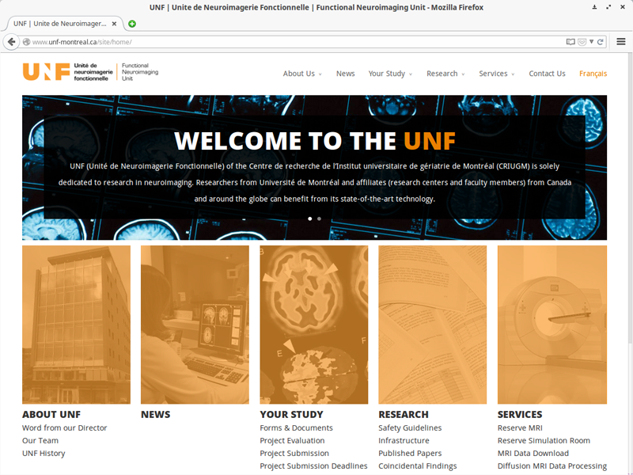
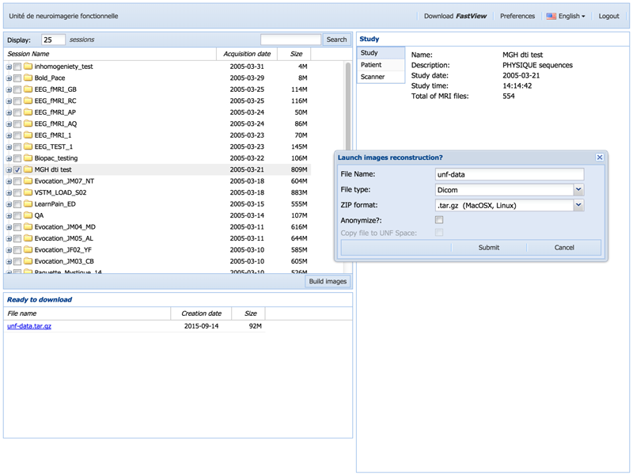

# Data retrieval and preparation 

## From the UNF web interface
The easiest and most practical way to retrieve data acquired at the Unité de Neuroimagerie Fonctionnelle (UNF) is to use the platform available at the UNF website. This platform takes care of all that is necessary to prepare and reconstruct the images from the scanner into a downloadable Dicom format. All UNF scans are archived in two copies, one copy on the web server where you can retrieve your images, and a copy on our archiving system. The scans are archived and accessible ad vitam æternam. It is therefore not necessary for you to make extra copies of your scans.
. You can access the site either from **the website of the [Neuroimaging unit](http://www.unf-montreal.ca)** (Menu `Services` then `MRI Data Download`), or directly from **[the download platform of the unit](https://unf-montreal.ca)**

### Data preparation

1. Before you can download the data, you need to reconstruct them into Dicom format. To do so, go to the UNF data download website [https://unf-montreal.ca](https://unf-montreal.ca)
2. Enter your UNF user ID and password
3. Select the data you want to download and click on `Build images` (keep the default option `tar.gz` for image compression type. TOAD will only work with this type)
4. Give a name to the dataset to be downloaded (in our example, `unf-data`), and click on `submit`

Data will be ready for download after a few moments.
**Do not close** your browser window; we will come back to it later.

### Data download

In the meantime, open a terminal window and connect to one of the UNF servers (Magma or Stark) via ssh.

~~~bash
# Replace 'username' by your user ID at the UNF
ssh -Y username@stark.criugm.qc.ca
~~~ 
 
The server will ask for your login information 

Once connected, navigate to your data directory:

~~~bash
# Replace `labname` by the name of the lab/group you belong to
# Replace `username` by your user ID at the UNF
cd /data/labname/username/
~~~

If necessary, create a new folder for your project and go to this directory:

~~~bash
# Replace 'project_name' by the name of the folder your are naming
mkdir project_name

# To go to the new folder
cd project_name
~~~

Download the data prepared by the UNF platform:

1. Go back to the browser window where you are downloading your data.
2. If your data is ready for download (after clicking the `build images` button), you will see a link (in blue) with the name you had specified earlier (`unf-data.tar.gz` in our example) under the section `Ready to download`, located on the left corner of the window. The link will be available for 7 days.
Copy the link address by right-clicking on the link-> **`Copy link location`**, in our example, it would be `http://downloads.criugm.qc.ca/username/unf-data.tar.gz`
3. Go back to the previous terminal with the ssh session, and type the command `wget`, followed by pasting the link address:

~~~bash
# Type wget, followed by space, then right-click, choose `Paste`, or control-shift-v
wget http://downloads.criugm.qc.ca/username/unf-data.tar.gz
~~~

