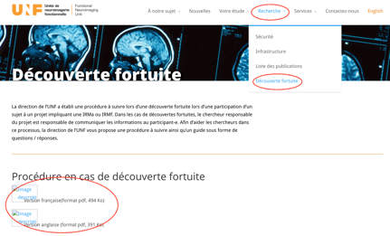

# Co-incidental findings

-   If an area of interest is noticed on an imaging set, the protocol for co-incidental finding will be initiated.

-   Please see [*website*](http://www.unf-montreal.ca/site/coincidental-findings/) for the most current version.

**If an area of interest is noticed during a MRI session, the images can be forwarded to a Radiologist for a summary. As the imaging acquired during research scans are not the same imaging sequences as a clinical scan and the radiologist does not have the participants clinical history, a clinical report can not be generated.**

