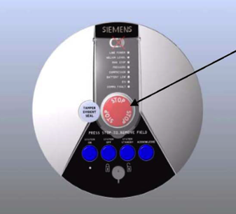

# Emergency Measures: Quench

## Definition: QUENCH

Quenching refers to the events that occur when the liquid cryogens that cool the magnet coils boil off rapidly, which results in helium escaping very rapidly from the cryogen bath. This means that the coils cease to be superconducting and become resistive. A quench will in general be accompanied by a loud bang or thundering or hissing or rushing sound with the cold gas expulsion.

Quenching may occur by activation of the magnet STOP button, or spontaneously, caused by a fault in the magnet itself. The magnet emergency stop button should only be used in the event of the magnetic field causing patient or personnel injury, and a shutdown of the static field is necessary, or if fire or some other unforeseen occurrence requires the quick access of emergency personnel to the examination room. Note however, that initiating a quench may not result in total removal of the magnetic field, and a danger may still exist. Some magnets only partially quench and so the field is not completely removed. In such cases care should still be taken when handling ferromagnetic objects near the magnet.

One of our magnet manuals suggests that the field strength is likely to be reduced to \~20 mT after about 20 seconds of a quench.

<http://www.revisemri.com/questions/safety/quenching>

## Emergency Measures: Quench Procedure

-   *In the event of a QUENCH in the MRI unit, MRI personnel must evacuate the magnet room if possible, and the UNF department. *

>*If someone was in the magnet or in the magnet room during the QUENCH, get the person/people out of the MRI room, then assist the individual(s) using first responder principles.*

-   call **5555** for all emergencies; Identify:

    -   What the emergency is:
    
       **Magnet Quench in the MRI room C-0674**

	-   Where you are:

	 **Unité de Neuroimagerie Fonctionnelle**

	- Who you are 

		**Your Name**

*Once everyone is out of the magnet room LOCK the door.*

> *If Emergency Response team is present, ensure they are aware a
    residual magnet field exists.*

> *Inform Unité de Neuroimagerie Fonctionnelle staff of the events.*

>*UNF Staff will inform management, Siemens Uptime Service, etc.*

> *Siemens Uptime Service 1-800-359-6709 Site \#8010 write summary of
> incident (incident report)*

## Magnet Stop button

**This button deenergizes the superconductive magnet** (quench).

*-   Push this switch in emergency situations in the magnetic field and notify Siemens Service immediately*

*-   Only superconductive magnets have a Magnet Stop switch - permanent magnets cannot be switched off*

## Quench

A quench occurs when there is a sudden loss of superconductivity in a magnet coil resulting from local temperature increases in the magnet.
The cryogens used for superconductivity suddenly evaporate causing the magnetic field to lift in less than 20 seconds.

A quench may occur as follows:

-   Start-up of the MR system (ramping up or filling the magnet)

-   An accident (earthquake, fire, etc.)

A quench may be released by the user in a controlled fashion by activating the Magnet Stop button.

*Siemens Healthcare\_ Safety\_Guide\_AE\_4c.pdf* p.15
