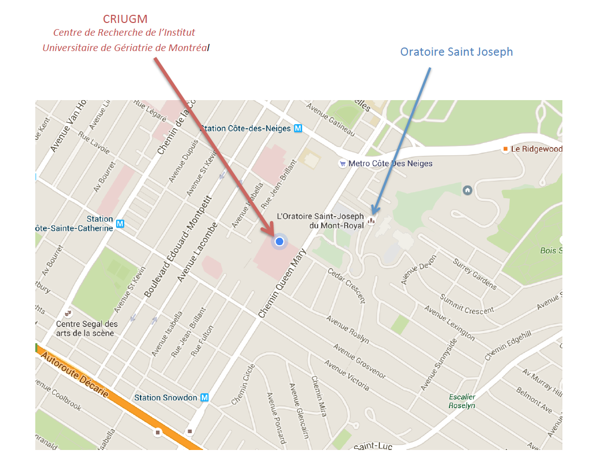
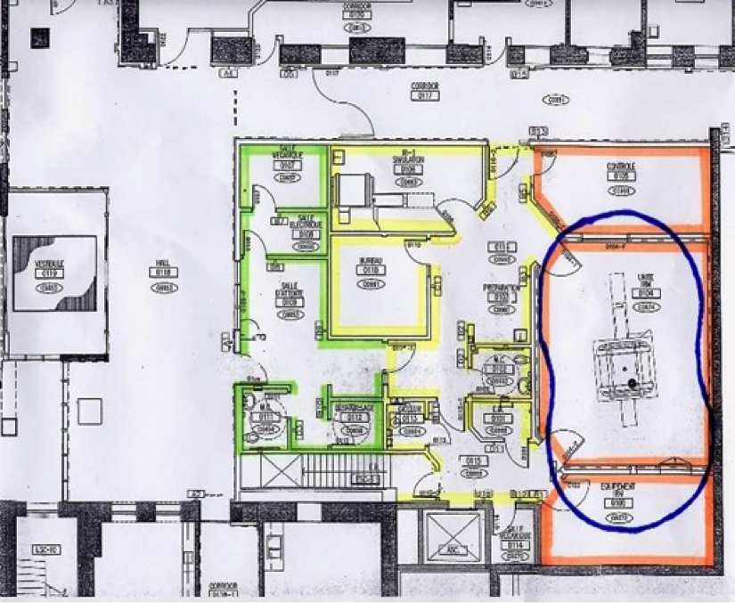

# Introduction to the Unité de Neuroimagerie Fonctionnelle (UNF)

## General information

Please spend some time to browse through the UNF website [*www.unf-montreal.ca*](http://www.unf-montreal.ca/)


Answers to most of your questions can be found on the website; whether, you are **setting up an experiment**, wanting to find out the **dates for submitting a project**, looking for **forms** or recuperation imaging data, the latest information are available.

### UNF contact list

|   Name            |         Title          |   Phone       |   Email      |
|:----------------:|:----------------------:|:-----------------:|:---------------:|
| **Pierre Bellec** | Scientific director | (514) 340-2800 Ext. 3367 | [**pierre.bellec@criugm.qc.ca**](mailto:pierre.bellec@criugm.qc.ca) |
| **Julien Cohen-Adad** | Associate director | (514) 340-5121 Ext.2264 | [**jcohen@polymtl.ca**](mailto:jcohen@polymtl.ca)|
| **Karim Jerbi** | Associate director |  |[**karim.jerbi@umontreal.ca**](mailto:karim.jerbi@umontreal.ca) |
| **Habib Benali** | Associate director | (514) 340-2800 Ext. 4785 |  [**habib.benali@imed.jussieu.fr**](mailto:habib.benali@imed.jussieu.fr) |
| **Claude Godbout** | Admistrative coordinator UNF | (514) 340-2800 Ext. 3633 | [**claude.godbout@criugm.qc.ca**](mailto:claude.godbout@criugm.qc.ca) |
| **Carollyn Hurst** | MRI technologist | (514) 340-2800 Ext. 4722 | [**carollyn.hurst@criugm.qc.ca**](mailto:carollyn.hurst@criugm.qc.ca)  |
| <a name="acyr"></a>**André Cyr** | Technical coordinator | (514) 340-2800 Ext. 4723 | [**andre.cyr@criugm.qc.ca**](mailto:andre.cyr@criugm.qc.ca) |
| **Arnaud Boré** | Systems administrator | (514) 340-2800 Ext. 3938 | [**arnaud.bore@gmail.com**](mailto:arnaud.bore@gmail.com) |
| **Basile Pinsard** | Systems administrator | (514) 340-2800 Ext. 3938 | [**basile.pinsard@gmail.com**](mailto:basile.pinsard@gmail.com) |


  ------------------------------------------------------------------

[*Page internet du personnel de l’UNF*](http://www.unf-montreal.ca/siteweb/Equipe\_en.html)

## Hours of Operation

### MRI Session and Control room

**Regular Working Hours**

- **Monday – Friday, except Statutory Holidays**

````
    9:00-12:00 and 13:00-17:00
````

**Outside of Regular Working Hours**

- **Lunch time, weekends, evenings, nights and statutory holidays**

> Contact the UNF staff for more information. An authorization is required to access the MRI room and control room outside of normal business hours.

### Simulation Room
**Regular Working Hours**

- **Monday – Friday, except Statutory Holidays**

```
-  if technical assistance is required from UNF Staff.
OR
- if you do not have an access
card for the UNF.

9:00-12:00 and 13:00-17:00
```

**Outside of Regular Working Hours**

```
- if NO technical assistance is required from the UNF Staff
AND
- you have a UNF access card.

24 hours a day / 7 days a week
```
No charge is associated with using the simulation room if a project for MRI has been approved by the ethics committee.

[www.unf-montreal.ca](http://www.unf-montreal.ca/)

## Access the UNF
### Where is the UNF
|To access the CRIUGM|To access the UNF|The UNF|
|:-:|:-:|:-:|
|[](../Pictures/Plan_CRIUGM.png)|[](../Pictures/Plan_entrance_CRIUGM.png)|[](../Pictures/Plan_UNF.png)|
### To enter the UNF – access card

To enter the UNF, you must have a magnetic card. The contact person for an access card is [Claude Godbout](#UNF-contact-list). A $20 deposit is required to get a card.

### UNF Zones


