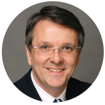
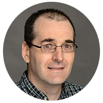
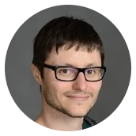
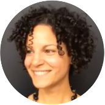
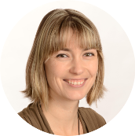
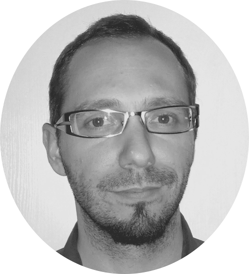

# UNF Documentation - Relevant elements

Welcome on the UNF documentation. This documentation is a guide to the procedures to follow as UNF users.

## A word from the scientific director
Unité de Neuroimagerie Fonctionnelle  
Centre de Recherche,  
Institut Universitaire de Gériatrie de Montréal

Since 2004, the Functional Neuroimaging Unit has enabled many research teams from the greater Montréal and elsewhere to carry out innovative studies using its state-of-the-art infrastructure including a Siemens 3.0T MRI device as a masterpiece, numerous related equipment allowing the acquisition of multimodal data and highly qualified personnel determined to offer a quality service to researchers and their teams.

The use of this magnificent neuroimaging research platform involves several responsibilities and obligations on the part of all users, without exception.

All users now have access to a document entitled "Procedures at the UNF" which describes in a clear and instructive way all the information necessary to carry out a research project at the UNF and the use of the equipment in place. We hope this document will answer questions that have regularly been raised by users. The writing of this document was made possible thanks to the remarkable work of two exceptional students, Edith Durand and Michèle Masson-Trottier, the greatly appreciated contribution of Kristina Martinu, Julien Jarret, Guillaume Vallet and Arnaud Boré, as well as the important Contribution of Carollyn Hurst, MRI technologist, and André Cyr, technical coordinator, both UNF employees.

As Scientific Director of the UNF, and on behalf of the scientific community using this regional platform, I would like to extend my warmest thanks to all those who participated in the development of this working document, particularly Edith and Michèle for their leadership in this project.

Good reading.
Julien Doyon, Ph.D.
Scientific Director UNF

## L’équipe

 **Julien Doyon** : scientific director <a href="http://www.unf-montreal.ca"target="blank">UNF (Unité de Neuroimagerie Fonctionnelle)</a>

 **Carollyn Hurst** : MRI Technologist at UNF

**André Cyr** : Technical Coordinator at UNF

**Arnaud Boré** : Network administrator

 **Edith Durand** : PhD student, Leader of the project

 **Michèle Masson-Trottier** : PhD student

 **Julien Jarret** : PhD student

 **Kristina Aurousseau** : Research assistant

  **Guillaume Vallet**: University lecturer
