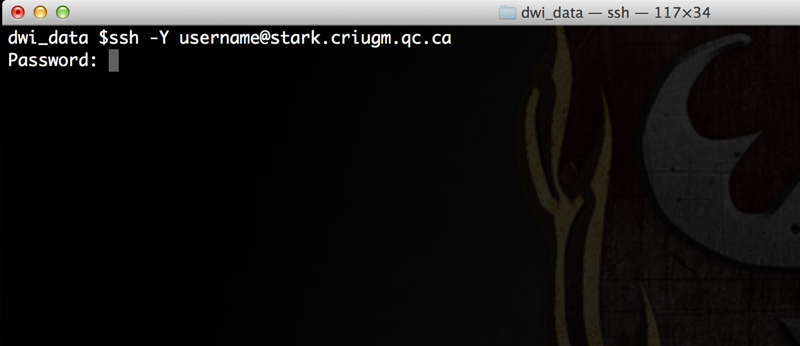

# Téléchargement des données

Après vous être connecté sur votre compte, une interface s’ouvrira avec les séances d’acquisition identifiées selon votre code. Vous pourrez alors télécharger les données d'imagerie qui ont été transférées sur le serveur.

-   Panneau de gauche :

    -   les cas prêts à être téléchargés sont affichés : une seule séquence ou la séance entière peut être sélectionnée.

-   Panneau de droite:

-   Les paramètres IRM, l’identification du participant, la date de l’examen en IRM, etc. sont disponibles.

-   

1.  *Sélectionner un item à télécharger *

2.  *Renommer le dossier au besoin*

3.  *Choisissez un format de compression soumettez *

4.  *Préparation des images *

*Quand le téléchargement est complété, les images sont disponibles pour être téléchargées.* 

Vous pouvez consulter **TOolkit d’Analyse de Diffusion
([*TOAD*](http://unf-montreal.ca/toad/html/fr/))** pour des instructions détaillées du traitement de données en IRM de diffusion.

Pendant ce temps, ouvrez un terminal sur votre ordinateur et connectez-vous en ssh à un des serveurs de l’UNF (Magma ou Stark).

~~~bash
# Remplacer 'username' par votre identifiant de votre compte UNF
ssh -Y username@stark.criugm.qc.ca
~~~ 

Le serveur vous demandera alors le mot de passe de votre compte UNF.

Une fois connecté, naviguez  dans votre répertoire de données :

~~~bash
# Remplacer 'labname' par le nom du laboratoire 
# Remplacer 'username' par l’identifiant de votre compte UNF
cd /data/labname/username/
~~~

Au besoin, créez un nouveau répertoire pour votre projet et déplacez-vous dans ce répertoire :

~~~bash
# Remplacer 'project_name' par le nom du projet
mkdir project_name

# Aller dans le nouveau répertoire
cd project_name
~~~

Téléchargement des données préparées par l’UNF :

1. Retourner sur la page internet du site internet de l’UNF (si vous avez fermé votre navigateur, le lien est disponible pendant 7 jours dans la section `Services/Récupération des données IRM`)
2. Dans l’encadré en bas à gauche de la fenêtre, vous trouverez le lien (en bleu) des données préparées (le nom donné auparavant, comme 'unf-data.tar.gz'). **Copier le lien préparé par le système (clic droit, `Copier le lien`/`Copy link location`)**, dans notre exemple `http://downloads.criugm.qc.ca/username/unf-data.tar.gz`
3. Dans le terminal, entrer la commande suivante pour télécharger les données

~~~bash
# Taper wget puis un espace et faite un clic droit `Coller` ou control-shift-v
wget http://downloads.criugm.qc.ca/username/unf-data.tar.gz
~~~

