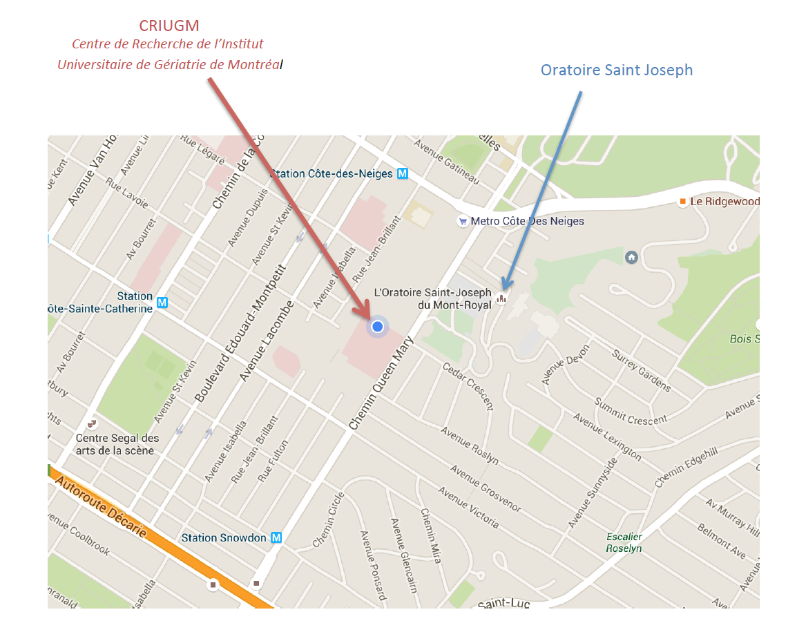
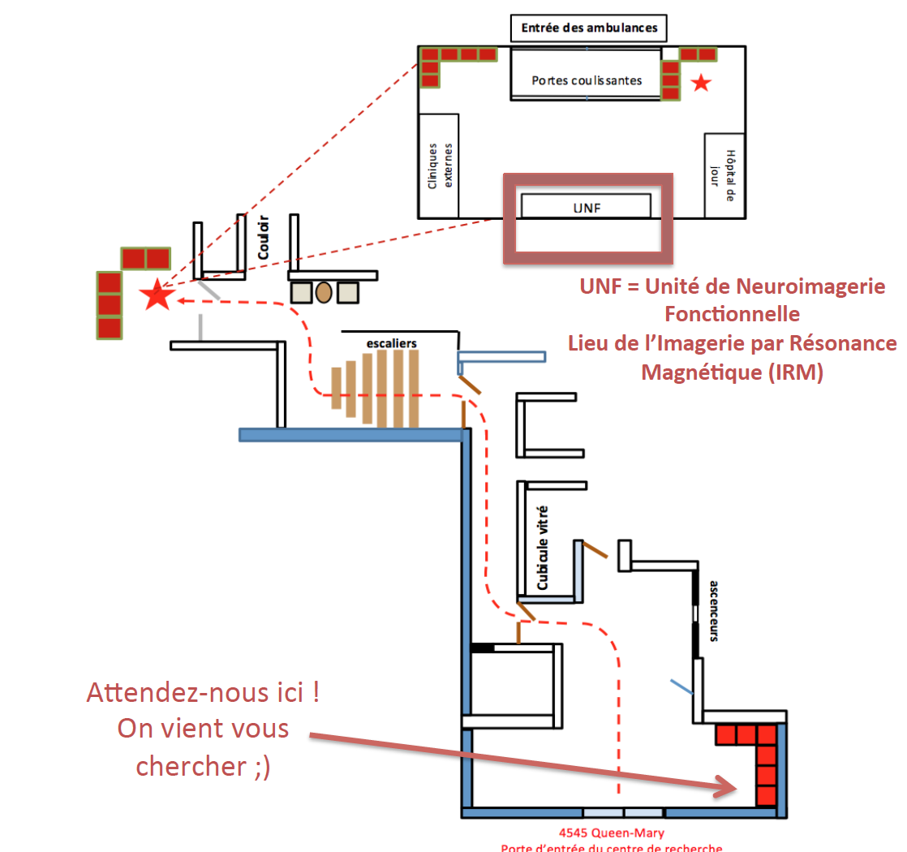
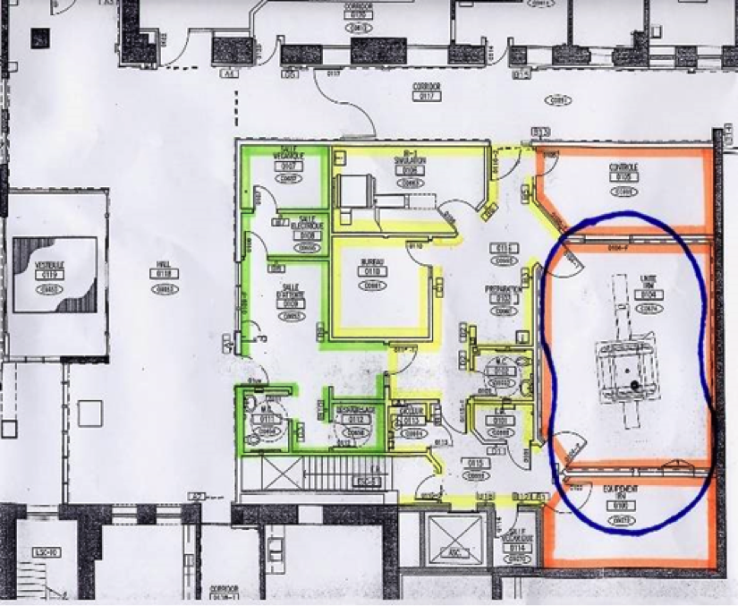

#Introduction à l’Unité de Neuroimagerie Fonctionnelle (UNF)

## Informations générales

Pour toute information ne figurant pas dans le présent document, consultez le <a href="http://www.unf-montreal.ca/site/home-fr/" target="blank">site web de l’UNF</a> ou contactez l'un des membres de l'équipe.


Les réponses à la plupart de vos questions peuvent y être trouvées, que vous soyez en train de mettre en place un protocole, cherchiez à connaître les dates pour la soumission d'un projet, soyez à la recherche de formulaires ou de la procédure pour récupérer vos données d'imagerie. Les informations les plus à jour sont sur ce site Internet.

<a name="liste"></a>
### Liste de contacts UNF

|   Nom            |         Titre          |   Téléphone       |   Courriel      |
|:----------------:|:----------------------:|:-----------------:|:---------------:|
| **Pierre Bellec** | Directeur scientifique | (514) 340-2800 Ext. 3367 | [**pierre.bellec@criugm.qc.ca**](mailto:pierre.bellec@criugm.qc.ca) |
| **Julien Cohen-Adad** | Adjoint au directeur scientifique | (514) 340-5121 Ext.2264 | [**jcohen@polymtl.ca**](mailto:jcohen@polymtl.ca) |
| **Karim Jerbi** | Adjoint au directeur scientifique | | [**karim.jerbi@umontreal.ca**](mailto:karim.jerbi@umontreal.ca) |
| **Habib  Benali** | Adjoint au directeur scientifique | (514) 340-2800 Ext. 4785 |  [**habib.benali@imed.jussieu.fr**](mailto:habib.benali@imed.jussieu.fr) |
|**Claude Godbout** | Coordonnatrice administrative UNF | (514) 340-2800 Ext. 3633 | [**claude.godbout@criugm.qc.ca**](mailto:claude.godbout@criugm.qc.ca) |
| **Carollyn Hurst** | Technologue IRM | (514) 340-2800 Ext. 4722 | [**carollyn.hurst@criugm.qc.ca**](mailto:carollyn.hurst@criugm.qc.ca) |
| <a name="acyr"></a>**André Cyr** | Coordonnateur technique | (514) 340-2800 Ext. 4723 | [**andre.cyr@criugm.qc.ca**](mailto:andre.cyr@criugm.qc.ca) |
| **Arnaud Boré** | Administrateur systèmes | (514) 340-2800 Ext. 3938 | [**arnaud.bore@gmail.com**](mailto:arnaud.bore@gmail.com) |
| **Basile Pinsard** | Administrateur systèmes | (514) 340-2800 Ext.3938 | [**basile.pinsard@gmail.com**](mailto:basile.pinsard@gmail.com) |

  ----------------------------------------------------------------------

<a href="http://www.unf-montreal.ca/site/our-team-fr/" target="blank">Page internet du personnel de l'UNF</a>


## Heures d’ouverture
### Séance d’IRM et salle de contrôle

**Heures d’ouverture régulières**

```
Du lundi au vendredi, sauf jours fériés
9h00-12h00 et 13h00-17h00
```

**En dehors des heures régulières**
```
Midi, fins de semaine, soirées, nuits et jours fériés

Contacter le personnel de l’UNF pour plus d’informations.
Une autorisation est requise pour accéder à la salle d’IRM
ou à la salle de contrôle en dehors des heures d’ouverture normales.
```

### Salle de simulation

**Heures d’ouverture régulières**

  Lundi au vendredi, sauf jours fériés

```
9h00-12h00 et 13h00-17h00

si vous avez besoin d'une aide technique du personnel de l’UNF
 OU
si vous n’avez pas de carte d’accès pour entrer à l’UNF
```

**En dehors des heures régulières**

```
7 jours par semaine, 24h sur 24

si vous n'avez pas besoin d'une aide technique du personnel de l’UNF
 ET
si vous avez une carte d’accès pour entrer à l’UNF
```

Il n'y a aucun frais pour l'utilisation de la salle de simulation. Celle-ci doit toutefois être utilisée en lien avec des projets en cours à l'UNF ou en préparation de ceux-ci.

##Accès à l’UNF

|Carte|Plan d'accès au CRIUGM|Accès UNF via entrée du CRIUGM|
|:-:|:-:|:-:|
|[](../Pictures/Plan_CRIUGM.png)|[](../Pictures/Plan_entrance_CRIUGM.png)|[](../Pictures/Plan_UNF.png)|


### Carte d'accès pour entrer à l’UNF

Pour entrer à l’UNF, il faut avoir une carte d’accès. La
personne-ressource pour obtenir une carte d’accès est Mme [Claude Godbout](#liste). Un dépôt de 20$ est requis pour obtenir une carte. De plus, vous devez avoir complété la [formation de sécurité en IRM](http://www.unf-montreal.ca/site/securite-fr/) avant d'obtenir votre carte.

#### Zones de l’UNF


