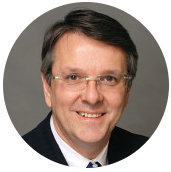
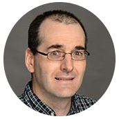
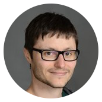
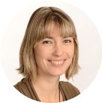

# Documentation UNF - Éléments à connaître

Bienvenue sur la documentation en français "Éléments à connaître" pour les utlisateurs de l'UNF. Cette documentation est un guide des procédures à suivre en tant qu'utilisateurs de l'UNF.

## Mot du Directeur Scientifique
Unité de Neuroimagerie Fonctionnelle  
Centre de Recherche,  
Institut Universitaire de Gériatrie de Montréal

Depuis 2004, l’Unité de neuroimagerie fonctionnelle permet à de nombreuses équipes de recherche du grand Montréal et d’ailleurs d’effectuer des études novatrices grâce à une infrastructure de pointe comprenant un appareil d’IRM 3.0T de Siemens comme pièce maitresse, de nombreux équipements connexes permettant l’acquisition de données multimodales et un personnel hautement qualifié déterminé à offrir un service de qualité aux chercheurs et leurs équipes.

L’utilisation de cette magnifique plateforme de recherche en neuroimagerie comporte plusieurs responsabilités et obligations de la part de tous les utilisateurs, sans exception.  

L’ensemble des utilisateurs ont maintenant accès à un document intitulé « Procédures à l’UNF » qui décrit de façon claire et instructive l’ensemble des renseignements nécessaires à la réalisation d’un projet de recherche à l’UNF et à l’utilisation des équipements en place. Nous espérons que ce document répondra aux questions qui se sont régulièrement soulevées par les utilisateurs. La rédaction de ce document a été rendu possible grâce au travail remarquable de deux étudiantes exceptionnelles, Edith Durand et Michèle Masson Trottier, de l’apport grandement apprécié de Kristina Martinu,  Julien Jarret, Guillaume Vallet et Arnaud Boré, ainsi que de l’importante contribution de Carollyn Hurst, technologue en IRM, et André Cyr, coordinateur technique, tous deux employés de l’UNF.

À titre de Directeur scientifique de l’UNF, et au nom de la communauté scientifique qui utilise cette plateforme régionale, je tiens à remercier chaleureusement tous ceux et celles qui ont participé à l’élaboration de ce document de travail, et particulièrement Edith et Michèle pour leur leadership dans ce projet.

Bonne lecture.  
Julien Doyon, Ph.D.  
Directeur scientifique UNF

## L’équipe

 **Julien Doyon** : directeur scientifique de l’<a href="http://www.unf-montreal.ca"target="blank">UNF (Unité de Neuroimagerie Fonctionnelle)</a>, Suivi du projet

 **Carollyn Hurst** : technologue de l'UNF, Conception du document maître

 **André Cyr** : coordonateur technique de l'UNF, Révision du document et mise en ligne

  **Arnaud Boré** : Administrateur neuroinformatique, Révision du document

 **Edith Durand** : Etudiante au doctorat, Organisation et suivi du projet, traduction du document

 **Michèle Masson-Trottier** : Etudiante au doctorat, Organisation et suivi du projet, traduction du document

 **Julien Jarret** : Doctorant, Révision du document

 **Kristina Aurousseau** : Professionnelle de recherche, Révision du document

  **Guillaume Vallet**: Maître de conférences, Mise en forme du document
